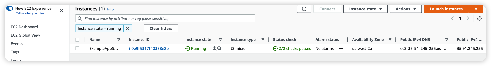

# Terraform example for AWS

This is an example to show how to create an EC2 instance in AWS.

> Firstly you need to add AWS authentication to environment.

    export AWS_ACCESS_KEY_ID=
    export AWS_SECRET_ACCESS_KEY=

Each Terraform configuration must be in its own working directory. Create a directory for your configuration.

    mkdir learn-terraform-aws-instance

Change into the directory.

    cd learn-terraform-aws-instance

Create a file to define your infrastructure.

    touch main.tf

Open main.tf in your text editor, paste in the configuration below, and save the file.

    terraform {
        required_providers {
            aws = {
                    source  = "hashicorp/aws"
                    version = "~> 4.16"
                }
            }
        
            required_version = ">= 1.2.0"
        }
        
        provider "aws" {
            region  = "us-west-2"
        }
        
        resource "aws_instance" "app_server" {
        ami           = "ami-830c94e3"
        instance_type = "t2.micro"
        
        tags = {
            Name = "ExampleAppServerInstance"
        }
    }

The result should be:

